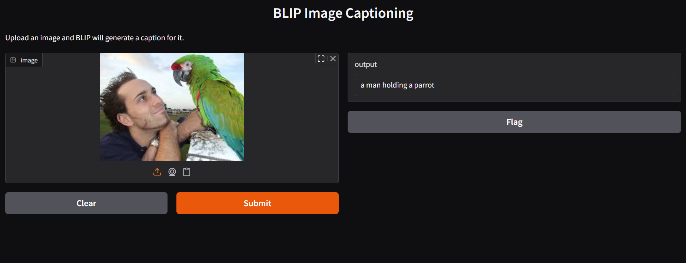

# Image Caption Generator Using BLIP

This project demonstrates a multimodal application that generates descriptive captions for images using the BLIP (Bootstrapped Language-Image Pretraining) model from Salesforce.

## Overview

- **Input:** An image file (JPG or PNG)
- **Output:** A textual caption describing the image

The application uses a Vision Transformer (ViT) as the vision encoder and a Transformer-based decoder to generate captions conditioned on the visual input. BLIP is pretrained on image-text matching, captioning, and question answering tasks.

## Example

**Sample Input Image:**


**Generated Output Image:**



*The output image above demonstrates the result of the BLIP image captioning process. The caption is generated by the BLIP model based on the input image.*

## How to Run

1. **Install dependencies**  
   The notebook will install all required packages automatically, but you can also install them manually:
   ```sh
   pip install transformers pillow torch gradio
   ```

2. **Open the Notebook**  
   Open `Image_Caption_Generator_Using_BLIP.ipynb` in Jupyter Notebook or Google Colab.

3. **Run the Notebook**  
   Execute all cells. You will be able to upload an image and receive a generated caption via the Gradio interface.

## Model Details

- **Model:** [Salesforce/blip-image-captioning-base](https://huggingface.co/Salesforce/blip-image-captioning-base)
- **Libraries:** `transformers`, `torch`, `pillow`, `gradio`

## Usage

- Upload an image using the Gradio interface.
- The BLIP model will process the image and generate a descriptive caption.

---

**Author:**  
Assignment 5.2: Multimodal Application Demo

